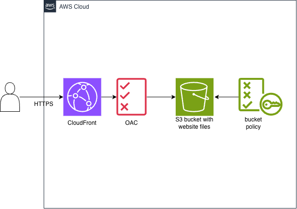

# AWS S3 CloudFront site hosting

This is a lab that serves a static site over HTTPS. **CloudFront** sits in front of a **private S3** bucket. The stack is built with Terraform.



**S3:** The bucket is not publicly accessible (Block Public Access). Objects are encrypted at rest with **SSE-S3 (AES-256)** (AWS-managed keys).

**CloudFront:** Viewers are redirected to HTTPS. Only this distribution can read objects, using Origin Access Control (OAC) and a bucket policy.

## To use

```bash
terraform init
terraform apply
aws s3 sync site/ s3://$(terraform output -raw bucket_name)
terraform output -raw cloudfront_url
```

`apply` does not upload `index.html`. Open the URL printed by the last command.

```bash
terraform destroy
```

Region: `ap-northeast-1`. Provider aws version: `~> 6.0` in `providers.tf`.

## Todo next

- GitHub Actions OIDC
- CloudFront / S3 access logging

## References
- https://docs.aws.amazon.com/AmazonCloudFront/latest/DeveloperGuide/private-content-restricting-access-to-s3.html
- https://registry.terraform.io/providers/hashicorp/aws/latest/docs/resources/cloudfront_distribution.html
- https://registry.terraform.io/providers/hashicorp/aws/latest/docs/resources/s3_bucket_public_access_block#argument-reference
- https://registry.terraform.io/providers/hashicorp/aws/latest/docs/resources/s3_bucket_server_side_encryption_configuration
- https://registry.terraform.io/providers/-/aws/6.8.0/docs/guides/version-6-upgrade
