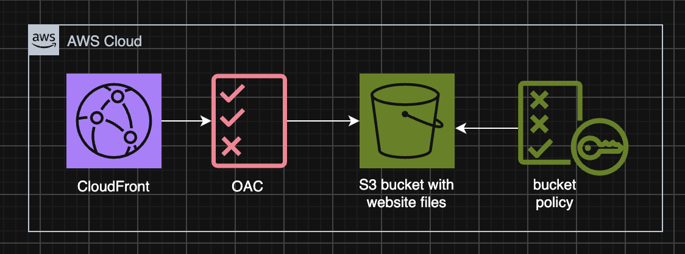
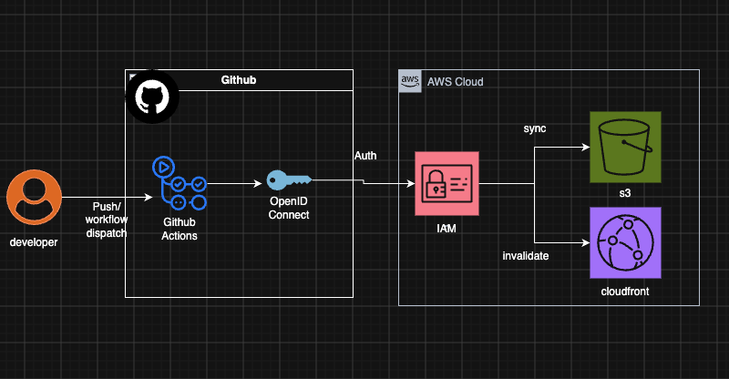

# AWS S3 CloudFront site hosting

This is a lab that serves a static site over HTTPS. **CloudFront** sits in front of a **private S3** bucket. The stack is built with Terraform.



**S3:** The bucket is not publicly accessible (Block Public Access). Objects are encrypted at rest with **SSE-S3 (AES-256)** (AWS-managed keys).

**CloudFront:** Viewers are redirected to HTTPS. Only this distribution can read objects, using Origin Access Control (OAC) and a bucket policy.

v2-oidc:

**OIDC**
GitHub Actions assumes the role with OIDC. Trust is this repository only. The role may run `s3 sync`  and invalidate this distribution. The workflow runs on push to `main` or on **workflow_dispatch**.


## Lab demo URL
`https://d24xzbhuqq5hx3.cloudfront.net`
note: this a lab url, may go away after destroy.

## Infrastructure setup (s3 + cloudfront)
```bash
terraform init
terraform apply
terraform output -raw cloudfront_url
```

Region: `ap-northeast-1`. Provider aws version: `~> 6.0` in `providers.tf`.

## OIDC Config
Set repository variables for [`.github/workflows/deploy.yml`](.github/workflows/deploy.yml):
```bash
AWS_ROLE_ARN: terraform output gha_role_arn
S3_BUCKET: terraform output bucket_name
CF_DISTRIBUTION_ID terraform output cloudfront_distribution_id
```

## Todo next
- CloudFront / S3 access logging

## References
v1-s3-cf:
- https://docs.aws.amazon.com/AmazonCloudFront/latest/DeveloperGuide/private-content-restricting-access-to-s3.html
- https://registry.terraform.io/providers/hashicorp/aws/latest/docs/resources/cloudfront_distribution.html
- https://registry.terraform.io/providers/hashicorp/aws/latest/docs/resources/s3_bucket_public_access_block#argument-reference
- https://registry.terraform.io/providers/hashicorp/aws/latest/docs/resources/s3_bucket_server_side_encryption_configuration
- https://registry.terraform.io/providers/-/aws/6.8.0/docs/guides/version-6-upgrade

v2-oidc:
- https://docs.github.com/en/actions/how-tos/secure-your-work/security-harden-deployments/oidc-in-aws
- https://docs.aws.amazon.com/IAM/latest/UserGuide/id_roles_providers_create_oidc.html